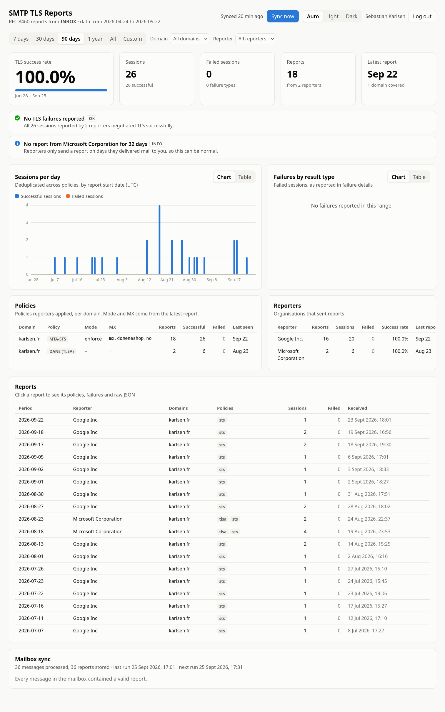

# TLSRPT dashboard

> [!NOTE]
> This project was created with [Anthropic Claude Opus 5.5](https://www.anthropic.com/claude).

A small self-hosted dashboard for **SMTP TLS Reporting** ([RFC 8460](https://www.rfc-editor.org/rfc/rfc8460)).
It reads the aggregate reports that mail providers (Google, Microsoft, …) send to your
`_smtp._tls` `rua=mailto:` address, stores them in MariaDB, and shows an overview:

- TLS success rate, session / failure / report counts
- findings: failures, MTA-STS still in `testing` mode, domains without a policy, silent reporters
- sessions per day (successful vs failed), failures by result type
- policies seen per domain (MTA-STS mode and MX, DANE/TLSA), reporters
- failure details grouped by receiving MX / IP and sending MTA
- every report, with its policies, failure details and raw JSON

The mailbox is opened **read-only**; nothing is flagged, moved or deleted. Opening the
dashboard **requires an OpenID Connect login** and membership of an allowed group. Design choices are recorded in
[DECISIONS.md](DECISIONS.md).



## Requirements

- Node.js ≥ 26 (see `.nvmrc`). The TypeScript server runs directly, with no build step.
- MariaDB (tested with 11.4 LTS). For development, `compose.yaml` provides one.

## Configuration

Copy `.env.example` to `.env`. All settings are environment variables:

| Variable                                      | Default                 |                                                                                                                                |
| --------------------------------------------- | ----------------------- | ------------------------------------------------------------------------------------------------------------------------------ |
| `IMAP_HOST`, `IMAP_USERNAME`, `IMAP_PASSWORD` | –                       | required to sync                                                                                                               |
| `IMAP_PORT` / `IMAP_DIR`                      | `993` / `INBOX`         |                                                                                                                                |
| `IMAP_TLS` / `IMAP_TLS_REJECT_UNAUTHORIZED`   | `true` on 993 / `true`  | STARTTLS on other ports                                                                                                        |
| `DB_HOST` / `DB_PORT`                         | `127.0.0.1` / `3306`    |                                                                                                                                |
| `DB_USER` / `DB_PASSWORD` / `DB_NAME`         | `tlsrpt` / – / `tlsrpt` | password required; schema is created at startup                                                                                |
| `DB_TLS` / `DB_POOL_SIZE`                     | `false` / `5`           |                                                                                                                                |
| `LISTEN_HOST` / `PORT`                        | `127.0.0.1` / `3000`    | `0.0.0.0` in containers                                                                                                        |
| `PUBLIC_URL`                                  | –                       | **required**: external origin, e.g. `https://tlsrpt.example.com`                                                               |
| `SYNC_INTERVAL_MINUTES`                       | `30`                    | `0` = manual only                                                                                                              |
| `OIDC_ISSUER`, `OIDC_CLIENT_ID`               | –                       | **required**                                                                                                                   |
| `OIDC_CLIENT_SECRET`                          | –                       | required unless `OIDC_TOKEN_AUTH_METHOD=none`                                                                                  |
| `OIDC_TOKEN_AUTH_METHOD`                      | `client_secret_basic`   | `client_secret_basic`, `client_secret_post`, `client_secret_jwt` or `none` (public client); must match the client registration |
| `OIDC_SCOPES`                                 | `openid profile email`  |                                                                                                                                |
| `OIDC_ALLOWED_GROUPS`                         | –                       | **required**: groups allowed to open the dashboard, comma separated                                                            |
| `OIDC_GROUPS_CLAIM`                           | `groups`                | claim holding the groups; dotted paths work, e.g. `realm_access.roles`                                                         |
| `SESSION_TTL_HOURS`                           | `12`                    |                                                                                                                                |

### OIDC

Register a client with your provider (Keycloak, Authentik, Entra ID, Google, …):

- redirect URI: `${PUBLIC_URL}/auth/callback`
- post-logout redirect URI: `${PUBLIC_URL}/`
- grant type: authorization code (PKCE S256 is always sent)
- token endpoint authentication: `client_secret_basic` by default. If the provider expects
  another method (e.g. Authelia's `token_endpoint_auth_method`), set `OIDC_TOKEN_AUTH_METHOD`
  to the same value.

The dashboard does not start without `OIDC_ISSUER`, `OIDC_CLIENT_ID`, `PUBLIC_URL` and
`OIDC_ALLOWED_GROUPS`. At login, the user's groups (from the ID token and userinfo, claim
`OIDC_GROUPS_CLAIM`) must include at least one allowed group; otherwise the login is
refused with a 403. Make sure the provider sends the claim: add a groups mapper (Keycloak,
Authentik), add `groups` to `OIDC_SCOPES` if the provider needs it (Dex), or point
`OIDC_GROUPS_CLAIM` at another claim. The claim must be a list of group names (or one
space/comma-separated string), or Zitadel project roles (below); other formats are refused.
A denied login is logged with the groups the user actually has, which shows the exact
values to allow. Group changes take effect at the next login, at
the latest after `SESSION_TTL_HOURS`.

**Zitadel:** use project roles, which are scoped to the organisation that granted them. They
are matched as `role@organisationId`, never as the bare role name, so another organisation
the project is granted to cannot give access by assigning the same role key:

```sh
OIDC_GROUPS_CLAIM=urn:zitadel:iam:org:project:roles
OIDC_ALLOWED_GROUPS=operations@123456789012345678   # role key @ organisation ID
```

In the Zitadel project, enable "Assert Roles on Authentication" (or add
`urn:zitadel:iam:org:projects:roles` to `OIDC_SCOPES`), otherwise the claim is not sent.

Only `/api/health` (for probes) and the login,
callback and logout routes work without a session. The CLI sync (`npm run sync`) does not
serve HTTP and only needs the database and IMAP settings.

## Development

```sh
npm install
docker compose up -d        # MariaDB (add --profile oidc for a mock OIDC provider on :8080)

npm run dev                 # API on :3000 + Vite dev server on http://localhost:5173
npm run sync                # one-off sync from the command line (-- --full to rescan the mailbox)
npm run demo                # serve synthetic data from the tlsrpt_demo database (login still required)
npm run check               # typecheck + eslint + prettier + tests (what CI runs)
npm run build               # build the UI into dist/web
npm start                   # serve API + built UI on http://127.0.0.1:3000
```

The MariaDB integration tests run when `TEST_DB_HOST` is set (see `.env.example`); they
drop and recreate the `tlsrpt_test` database. Login is also required in development:
start the mock provider (`docker compose --profile oidc up -d`; set `MOCK_OIDC_PORT` if 8080 is
taken, and adjust `OIDC_ISSUER` to match) and set, in `.env`:

```sh
PUBLIC_URL=http://localhost:5173
OIDC_ISSUER=http://localhost:8080/default
OIDC_CLIENT_ID=tlsrpt
OIDC_CLIENT_SECRET=anything
OIDC_ALLOW_INSECURE_ISSUER=true
OIDC_ALLOWED_GROUPS=tlsrpt
```

On the mock provider's login form, enter any username and the claims
`{"groups": ["tlsrpt"]}`.

## Release & deployment

[.github/workflows/release.yaml](.github/workflows/release.yaml) runs `npm run check` and
the build on every push and pull request. On `master` it also:

1. builds the app on Ubuntu and assembles the bundle ([scripts/bundle.sh](scripts/bundle.sh)):
   `dist/web`, the TypeScript server and its production `node_modules`,
2. publishes it as a cosign-signed `tlsrpt.tar.xz` GitHub release tagged `YYYY.MM.DD-<sha>`,
3. builds the image from the multi-stage [Dockerfile](Dockerfile): the app is built in
   `dhi.io/node:26-alpine-dev` and copied into the hardened `dhi.io/node:26-alpine` runtime
   (both digest-pinned), then pushed as `ghcr.io/<owner>/tlsrpt:<tag>` and `:latest`
   (amd64 + arm64), with SBOM and provenance, signed with cosign.

Pulling the Docker Hardened Images needs a Docker Hub account and a read-only access
token: for the workflow, the repository variable `DHI_USERNAME` and the secret `DHI_TOKEN`;
for Dependabot (which keeps the base image digests current), `DHI_USERNAME` and `DHI_TOKEN`
as Dependabot secrets, because Dependabot cannot read Actions variables or secrets.

The image is standalone: it runs as uid 1000, has no shell or package manager, and its
filesystem can be read-only. Configure it with the environment variables above
(`LISTEN_HOST=0.0.0.0` and `PORT=3000` are preset):

```sh
docker run -d --name tlsrpt -p 3000:3000 --read-only --cap-drop ALL \
  --env-file tlsrpt.env ghcr.io/<owner>/tlsrpt:latest
```

```yaml
# Kubernetes sketch
containers:
  - name: tlsrpt
    image: ghcr.io/<owner>/tlsrpt:latest
    env:
      - { name: PUBLIC_URL, value: 'https://tlsrpt.example.com' }
      - { name: DB_HOST, value: 'mariadb' }
    envFrom:
      - secretRef: { name: tlsrpt } # IMAP_*, DB_PASSWORD, OIDC_*
    ports:
      - { containerPort: 3000 }
    readinessProbe:
      httpGet: { path: /api/health, port: 3000 }
    securityContext:
      runAsNonRoot: true
      readOnlyRootFilesystem: true
      allowPrivilegeEscalation: false
      capabilities: { drop: [ALL] }
```

To build the image locally: `docker login dhi.io`, then `npm run docker:build`
(`docker build -t tlsrpt:local .`). Several replicas are fine:
migrations and mailbox syncs are serialised with MariaDB locks.

## API

|                                            |                                           |
| ------------------------------------------ | ----------------------------------------- |
| `GET /api/overview?from=&to=&domain=&org=` | KPIs, time series, breakdowns, insights   |
| `GET /api/reports?…`                       | report list (same filters)                |
| `GET /api/reports/:id`                     | one report, including the raw JSON        |
| `GET /api/filters`                         | available domains, reporters, date bounds |
| `GET /api/sync` / `POST /api/sync`         | sync status / start a sync                |
| `GET /api/me`                              | logged-in user                            |
| `GET /api/health`                          | liveness, never requires login            |
| `GET /auth/login`, `POST /auth/logout`     | OIDC login / logout                       |

Dates are `YYYY-MM-DD` (UTC).

## Layout

```
src/server/   config, IMAP sync, MIME + RFC 8460 parsing, MariaDB store, analysis, OIDC, HTTP API
src/shared/   types and constants shared with the UI
src/web/      React UI (hand-drawn SVG charts)
scripts/      release bundle, demo data generator
Dockerfile    multi-stage image build (dhi.io/node:26-alpine-dev → dhi.io/node:26-alpine)
test/         unit + MariaDB integration tests, real and synthetic report fixtures
dev/          MariaDB init script for compose.yaml
docs/         README assets (dashboard preview)
```
